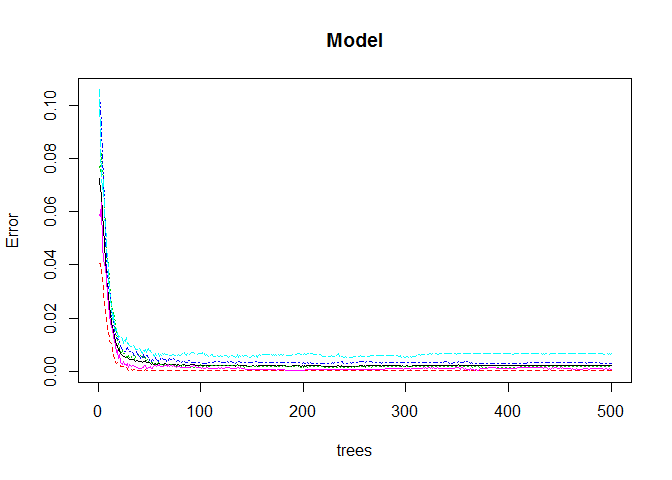

<b>Background</b>

Using devices such as Jawbone Up, Nike FuelBand, and Fitbit it is now possible to collect a large amount of data about personal activity relatively inexpensively. These type of devices are part of the quantified self movement - a group of enthusiasts who take measurements about themselves regularly to improve their health, to find patterns in their behavior, or because they are tech geeks. One thing that people regularly do is quantify how much of a particular activity they do, but they rarely quantify how well they do it.

<b>About the Data</b><br>
It Consista of data from accelerometers on the belt, forearm, arm, and dumbell of 6 participants. They were asked to perform barbell lifts correctly and incorrectly in 5 different ways. More information is available from the website here: http://groupware.les.inf.puc-rio.br/har (see the section on the Weight Lifting Exercise Dataset). 

<b>Goal</b><br>
Goal of this project is to predict the manner in which they did the exercise using the training and test data provided.

<b>Environment Setup</b>

```r
library(caret)
library(randomForest)
library(rattle)
```

<b>Load the Data</b>

```r
data<-read.csv("pml-training.csv",header=TRUE)
testdata<-read.csv("pml-testing.csv",header=TRUE)
```

<b>Explanatory Analysis</b><br>
There are 19622 observations and 160 variables.<br> 'Classe' Variable is what we will predict by using rest of the variables to train our model.<br>

On Analysing the data using summary function it is found that there are several variables which can be excluded from Model preparation, like :<br>
1. Variables having names and timestamps <br>
2. Variables which are almost constant or with near zero variance <br>
3. Variables having more NAs and #DIV/0!

<b>Clean up</B>

```r
# list of variables to be Removed-  which are names and timestamps
removelist<-c(1,2,3,4,5)

# Add list of variables which have near Zero variance
removelist<-append(removelist,nearZeroVar(data))

# remove from the dataset
data<-data[,-removelist]

# Still there are variables which have number of NAs


# Keep only those variables which has less than 95% NAs
size<-dim(data)
data<-data[, colSums(is.na(data)) < size[1]*.95] 
```

Now the data is clean and final set has 19622 observations and 54 variables.

```r
dim(data)
```

```
## [1] 19622    54
```

<B> Slice the data </b>

```r
trainIndex = createDataPartition(data$classe, p = 0.80)[[1]]

trainset<-data[trainIndex,]
testset<-data[-trainIndex,]
```

<b>Model Preparation</b><br>
We will fit model using RandomForest, as this is classification problem and RandomForest will automatically select important variables.<br>
randomforest() performs faster compared to "rf" when we have large data set.


```r
set.seed(405)
Model=randomForest(classe~.,data=trainset)
```

<b>Predict</b>

```r
# Predict
predicttrainset<-predict(Model,newdata=trainset)
predicttestset<-predict(Model,newdata=testset)
```

<b> Validate </b><br>
We observe that we have near 99% accuracy on our test set. <br>

```r
trainingConfusion <- confusionMatrix(trainset$classe, predicttrainset)
```

```
## Loading required namespace: e1071
```

```r
testingConfusion <- confusionMatrix(testset$classe, predicttestset)

testingConfusion
```

```
## Confusion Matrix and Statistics
## 
##           Reference
## Prediction    A    B    C    D    E
##          A 1116    0    0    0    0
##          B    3  755    1    0    0
##          C    0    0  684    0    0
##          D    0    0    1  642    0
##          E    0    0    0    0  721
## 
## Overall Statistics
##                                          
##                Accuracy : 0.9987         
##                  95% CI : (0.997, 0.9996)
##     No Information Rate : 0.2852         
##     P-Value [Acc > NIR] : < 2.2e-16      
##                                          
##                   Kappa : 0.9984         
##  Mcnemar's Test P-Value : NA             
## 
## Statistics by Class:
## 
##                      Class: A Class: B Class: C Class: D Class: E
## Sensitivity            0.9973   1.0000   0.9971   1.0000   1.0000
## Specificity            1.0000   0.9987   1.0000   0.9997   1.0000
## Pos Pred Value         1.0000   0.9947   1.0000   0.9984   1.0000
## Neg Pred Value         0.9989   1.0000   0.9994   1.0000   1.0000
## Prevalence             0.2852   0.1925   0.1749   0.1637   0.1838
## Detection Rate         0.2845   0.1925   0.1744   0.1637   0.1838
## Detection Prevalence   0.2845   0.1935   0.1744   0.1639   0.1838
## Balanced Accuracy      0.9987   0.9994   0.9985   0.9998   1.0000
```

From below plot we also observe that error rate reduces significantly after around 30 trees.
 

<b>Fina test</b><br>
Finally we will apply this model on the final test set provided.

```r
predictfinaltest<-predict(Model,newdata=testdata)
predictfinaltest
```

```
##  1  2  3  4  5  6  7  8  9 10 11 12 13 14 15 16 17 18 19 20 
##  B  A  B  A  A  E  D  B  A  A  B  C  B  A  E  E  A  B  B  B 
## Levels: A B C D E
```
